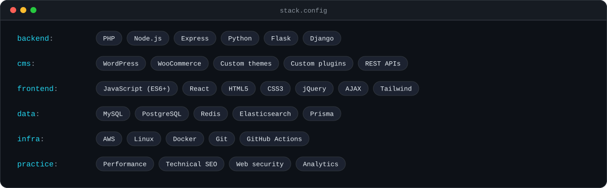
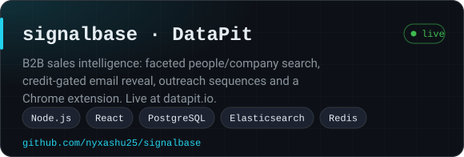
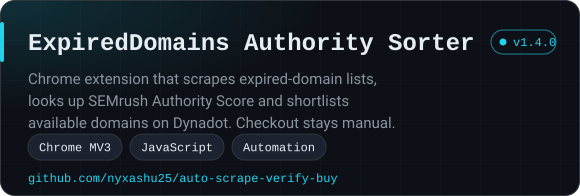

 

## About

I build and optimize client-facing websites end to end: frontend, backend, and the production troubleshooting in between. Over 3.5 years I have delivered **20+ WordPress projects** across real estate, finance, healthcare and automotive, with a focus on clean, scalable, high-converting builds.

Outside client work I build tools that automate data-heavy workflows, including a B2B sales-intelligence platform and a domain-research Chrome extension (below).

- **WordPress engineering**: custom themes and plugins, WooCommerce, REST and third-party API integrations
- **Performance and SEO**: speed optimization, technical SEO, analytics
- **Security-aware development**: website security fundamentals, secure coding, production troubleshooting
- **Full-stack side projects**: Node.js, React, PostgreSQL, Python

## Stack

## Featured work

  
  

## Tools

Small, focused utilities I built and keep tested. Each has its own README and CI.

| Tool | What it does |
|---|---|
| [**wp-security-hardening**](https://github.com/nyxashu25/wp-security-hardening) | WordPress plugin: security headers, login attempt limiting, username-discovery blocking and version hiding. PHP, 57 tests |
| [**wp-lead-form**](https://github.com/nyxashu25/wp-lead-form) | WordPress contact form with no CAPTCHA: honeypot, signed time token and rate limiting. Saves leads privately, emails you, exports CSV. PHP, 98 tests |
| [**seo-audit**](https://github.com/nyxashu25/seo-audit) | Python CLI that crawls a site and reports technical SEO problems: titles, canonicals, broken links, redirect chains, security headers |
| [**redirect-mapper**](https://github.com/nyxashu25/redirect-mapper) | Python CLI that checks a 301 redirect map for loops, chains and conflicts, then exports Apache, nginx or Netlify rules |
| [**excel-merger**](https://github.com/nyxashu25/excel-merger) | Python CLI and library that merges Excel and CSV files, aligning columns by header name |
| [**color-picker-extension**](https://github.com/nyxashu25/color-picker-extension) | Chrome side-panel eyedropper: copy HEX, RGB, HSL, HSV or CMYK and check WCAG contrast |
| [**notepad-extension**](https://github.com/nyxashu25/notepad-extension) | Multi-note notepad in the Chrome toolbar with search, pinning, autosave and export |

## Selected client work

A sample of production WordPress builds:

| Site | Role |
|---|---|
| [zfinity.in](https://zfinity.in) | Full-stack development |
| [securentity.com](https://securentity.com) | Security-focused implementation |
| [skyline.sa](https://skyline.sa) | WordPress development |

…and 17+ more across real estate, finance, healthcare and automotive.

## Experience

| Role | Company | Location |
|---|---|---|
| Web Developer (current) | DigiGrowth | Dubai, UAE |
| Web Developer | Digimedia Solutions | Pune, India |
| Intern, then Jr. Web Developer | Avenirya Solutions | Pune, India |

## GitHub activity

  
  

## Get in touch

I am open to conversations about WordPress, web performance and building data tools. The fastest way to reach me is on [LinkedIn](https://linkedin.com/in/nyxashu), or through my [portfolio](https://nyxashu25.github.io).
